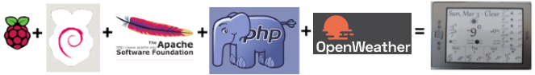

# KindleDisplay
Kindle eink display of weather conditions. Inspired by: [A Kindle Weather Display, the Easy Way](https://www.galacticstudios.org/kindle-weather-display/)

ServerSide configuration:
* Raspberry Pi
    * [Raspbian](https://www.raspberrypi.org/downloads/raspbian/)
    * Apache
    * php with the GD graphics drawing library
    * [Imagick](http://php.net/manual/en/book.imagick.php) Sore spot in this project. This component is a bit tricky to get running correctly. When developing only the GD library is needed for rendering image to a browser.
    * Weather data [Powered by Dark Sky](https://darksky.net/poweredby/)

ClientSide configuration:
* [Kindle 4 Non-Touch (K4NT)](https://en.wikipedia.org/wiki/Amazon_Kindle#Fourth_generation) Serial # B00E (or a browser when developing)

